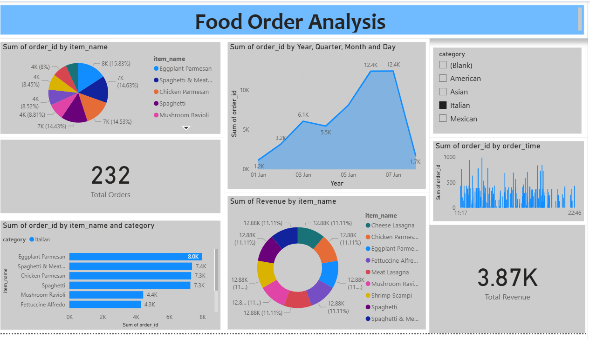

# 🍽️ Restaurant Order Analysis – SQL & Power BI

## 📌 Overview
This project explores restaurant ordering patterns and sales performance using **SQL** for data querying and **Power BI** for building a visual dashboard. The aim is to extract actionable insights for business decision-making.

---

## 🛠 Tools & Technologies
- **MySQL Workbench** – Data modeling and querying  
- **Power BI Desktop** – Dashboard creation  
- **CSV / Excel** – Data dictionary and export  
- **SQL & DAX** – For business logic and analysis

---

## 📁 Project Structure

| File | Description |
|------|-------------|
| `create_restaurant_db.sql` | SQL script to create and populate the database |
| `sql_analysis.sql` | Contains all SQL queries used for insights |
| `restaurant_db_data_dictionary.csv` | Column definitions and metadata |
| `food_order_analysis.pbix` | Power BI dashboard file |
| `Dash_board.png` | Dashboard screenshot for preview |

---

## 🔍 Objectives

### ✅ Menu Analysis
- Count total number of dishes  
- Identify cheapest & most expensive items  
- Focus on Italian items & their price range  
- Compute average price per category

### ✅ Order Behavior
- View date range and volume of orders  
- Orders with most items and >12 items  
- Time-of-day trends from `order_time`

### ✅ Customer Insights
- Join tables to get top 5 spend orders  
- Identify most & least ordered dishes  
- Revenue impact of desserts (20% higher spend)

---

## 📊 Power BI Dashboard

### 🖼️ Dashboard Preview

| Visual | Description |
|--------|-------------|
| 🥧 Pie Chart | Order distribution by item (e.g., *Eggplant Parmesan* highest) |
| 📈 Line Chart | Orders by date showing trend over time |
| ⏰ Bar Chart | Order density across different times of the day |
| 🔍 Filter Slicer | Filter by food category (Italian, American, etc.) |
| 📊 KPI Cards | Total Orders = 232, Total Revenue = ₹3.87K |
| 📉 Bar Chart | Orders by item grouped by category |
| 🍩 Donut Chart | Revenue contribution by each item |

---

## 📈 Key Insights
- 🥇 *Eggplant Parmesan* was the top-selling dish  
- 📊 Orders with desserts had 20% higher bill  
- 🧾 ₹3.87K total revenue from 232 orders  
- 📅 Peak ordering days were Jan 5–6  

---
